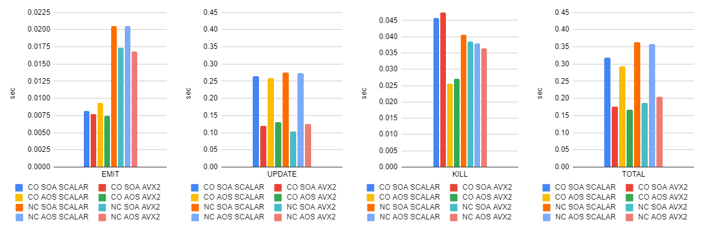
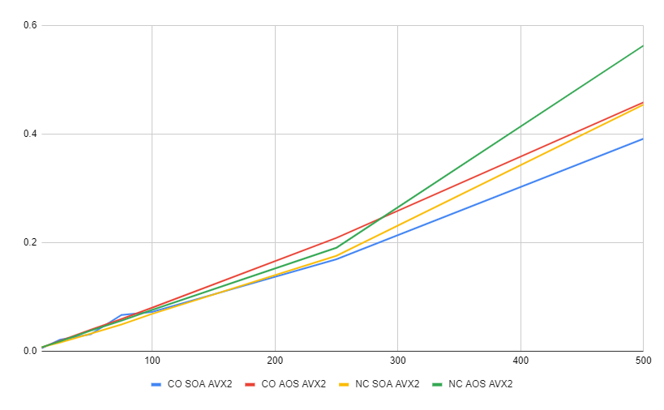
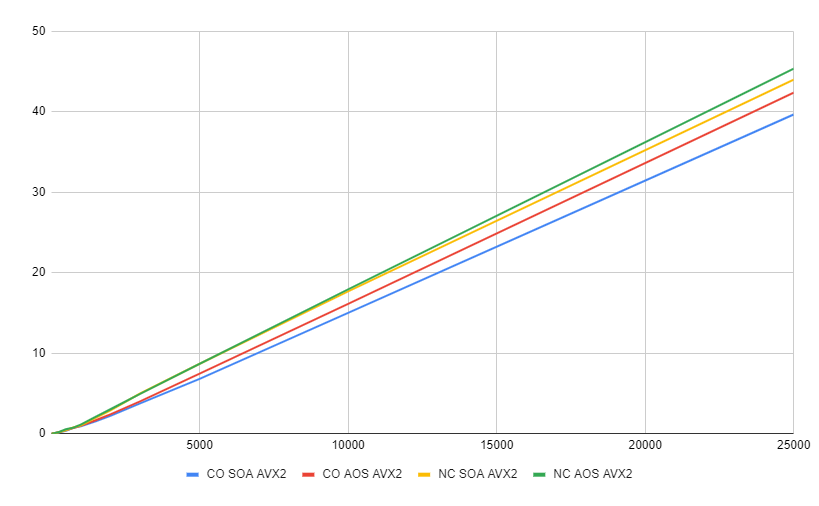

# Particle System Benchmark

## Problem

While designing a particle system for my game engine I came up with two different particle **storage strategies**:
1) Particles for different particle systems are stored contiguously in memory and updated linearly;
2) Particles for different particle systems are stored in different memory blocks and updated separately.

I also came up with two different SOA **particle layouts**:
1) SOA layout. No memory overhead.
   | Stream | 0 | 1 | 2 | 3 |
   |-|-|-|-|-|
   | Position.x | 0 | 1 | 2 | 3 |
   | Position.y | 0 | 1 | 2 | 3 |
   | Position.z | 0 | 1 | 2 | 3 |
   | Velocity.x | 0 | 1 | 2 | 3 |
   | Velocity.y | 0 | 1 | 2 | 3 |
   | Velocity.z | 0 | 1 | 2 | 3 |
   | Color.r | 0 | 1 | 2 | 3 |
   | Color.g | 0 | 1 | 2 | 3 |
   | Color.b | 0 | 1 | 2 | 3 |
   | Color.a | 0 | 1 | 2 | 3 |
   | Lifetime | 0 | 1 | 2 | 3 |
2) Hybrid SOA/AOS layout. 25% memory overhead on position and velocity (in order to support SIMD).
   | Stream | 0 | 1 | 2 | 3 | 4 | 5 | 6 | 7 | 8 | 9 | 10 | 11 | 12 | 13 | 14 | 15 |
   |-|-|-|-|-|-|-|-|-|-|-|-|-|-|-|-|-|
   | Position | x₀ | y₀ | z₀ | w₀ | x₁ | y₁ | z₁ | w₁ | x₂ | y₂ | z₂ | w₂ | x₃ | y₃ | z₃ | w₃ |
   | Velocity | x₀ | y₀ | z₀ | w₀ | x₁ | y₁ | z₁ | w₁ | x₂ | y₂ | z₂ | w₂ | x₃ | y₃ | z₃ | w₃ |
   | Color | r₀ | g₀ | b₀ | a₀ | r₁ | g₁ | b₁ | a₁ | r₂ | g₂ | b₂ | a₂ | r₃ | g₃ | b₃ | a₃ |
   | Lifetime | 0 | 1 | 2 | 3 | | | | | | |  |  |  |  |  |  |

The first storage strategy seemed much more cache-friendly, but since the particle system information is lost, it lacked a few useful properties:
1) Difficult to pause a specific particle system when it's out of view frustum;
2) Difficult to make a force or velocity in particle system's local space;
3) Difficult to cull particles for render with octree/bvh/kd-tree acceleration structure.

To figure out whether there's any real benefit of messing with one shared particle block, I started this benchmark.

## Benchmark

### 200 particle systems, up to 500 simultaneous particles on each particle system.

I don't think I will ever have over 200 particle systems on the screen, so this benchmark is an attempt to replicate a real game scenario.
Scalar/AVX2 benchmarks were done out of curiosity about how much AVX2 boosts the particle system.
All measurements are in nanoseconds.

| Routine | CO* SOA Scalar | CO SOA AVX2 | CO AOS Scalar | CO AOS AVX2 | NC* SOA Scalar | NC SOA AVX2 | NC AOS Scalar | NC AOS AVX2 |
|-|-|-|-|-|-|-|-|-|
| Update | 264531433 | 120406133 | 258164900 | 131445633 | 274460900 | 103556466 | 272462066 | 124984866 |
| Emit | 8153666 | 7688600 | 9332833 | 7460000 | 20566100 | 17359066 | 20542666 | 16783933 |
| Kill | 45811433 | 47438366 | 25554833 | 27144133 | 40538966 | 38558833 | 37910833 | 36486466 |
| TOTAL | 318670433 | 175722133 | 293242800 | 166263400 | 363986233 | 185967166 | 358752466 | 205320066 |

*\* — CO goes for contiguous, NC goes for non-contiguous. AOS is actually a hybrid SOA/AOS layout.*

### Variable particle system count, up to 500 simultaneous particles on each particle system.

The previous benchmark showed an obvious AVX2 superiority, so I won't include scalars here.

| Count | C SOA AVX2 | C AOS AVX2 | NC SOA AVX2 | NC AOS AVX2 |
|-|-|-|-|-|
| 10 | 5789200 | 7675500 | 7949200 | 7709800 |
| 25 | 21781700 | 19607500 | 16427700 | 18713200 |
| 50 | 31647400 | 40030300 | 32928000 | 38558100 |
| 75 | 67198200 | 59740300 | 49744700 | 56692800 |
| 100 | 72690000 | 80580700 | 69201100 | 76474300 |
| 250 | 169725700 | 208925000 | 176025600 | 190859500 |
| 500 | 391392700 | 458259900 | 454150100 | 562782900 |
| 750 | 739342800 | 719627600 | 777583800 | 763290900 |
| 1000 | 948196100 | 994504900 | 1042463100 | 1144094600 |
| 1500 | 1542934000 | 1680970400 | 1984370800 | 2110293600 |
| 2000 | 2246113400 | 2421090300 | 2922469100 | 3055432600 |
| 3000 | 3780697600 | 4026085600 | 5027165700 | 4974465500 |
| 5000 | 6819852000 | 7470285900 | 8700716600 | 8677681600 |
| 10000 | 15029344700 | 16136407900 | 17705982300 | 17937026600 |
| 25000 | 39668431500 | 42390617200 | 43988106000 | 45365968000 |

*Up to 500 particle systems.*

*Up to 25000 particle systems.*

## Conclusion

The contiguous storage strategy expectedly outperforms the non-contiguous one by about 10%. The SOA particle layout outperforms hybrid SOA/AOS by about 10% too. I went for a non-contiguous storage strategy and SOA particle layout because the former is much easier to support and extend, even though it's slightly slower, and the latter is faster and more memory efficient.

## References

https://www.bfilipek.com/2014/04/flexible-particle-system-start.html

https://www.popcornfx.com/the-popcornfx-script-execution-model/
